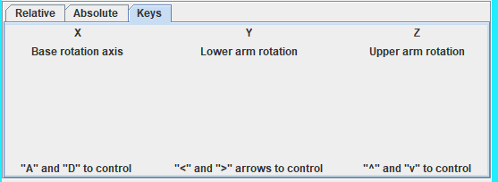
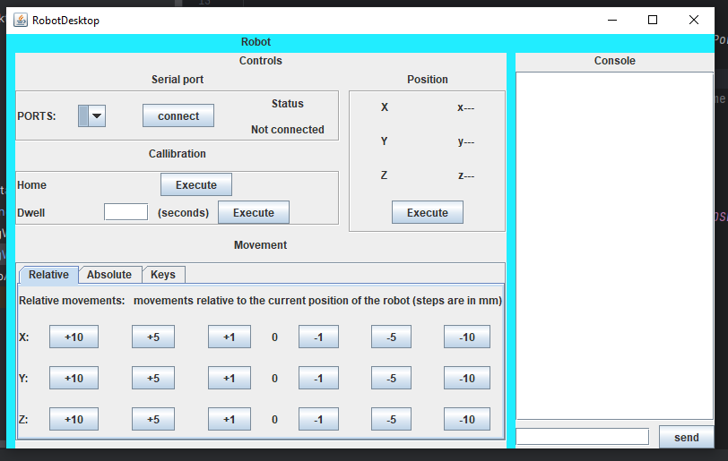

# RoboticArm controller
Robot arm controller written in java, using Swing for UI and communicates over USB via Serial communication 
## About the software
This repository is made to allow easier interaction between the robot and any computer (that runs java :D )..\
It currently supports the following:

-Display COM ports connected to the machine.\
-Allow choosing COM port to connect & give status regarding the connection.\
-Fast homing for the robot arm.\
-Dwell in seconds (essentially - 'sleep').\
-Display the current arm position (end effector position!).\
-Console! this UI has a GCode console built in!.\
-3 different types of controlling the robot (absolute, relative, via arrow keys)

## About the robot
This is a palletizer style robot, it offers 3 degrees of freedom whilst keeping the tip of the robotic arm directly perpendicular to the plane that the robot sits on, it is a mix between few different robots and some custom designed parts
The robot runs on a standard Nema 17 steppers

## Technologies used:
Controller:
Written in Java, using swing (to handle UI) and jSerialComm (to handle serial communication), built using Maven
Robot:
Arduino, 3D printer parts, uses standard Nema 17 steppers and GT2 belts, lots o' bearings!